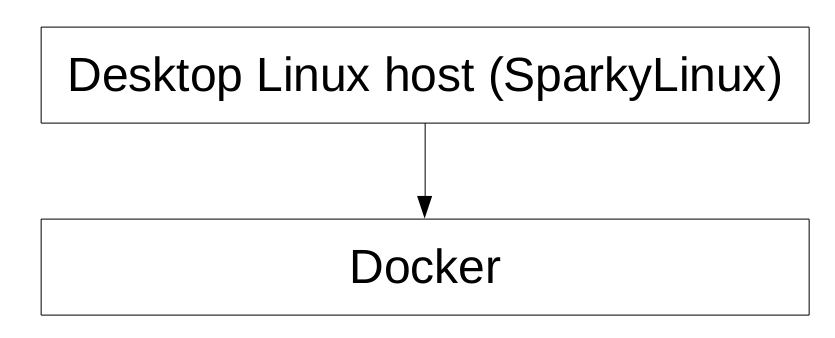

# Docker Tutorial - Debian Stretch

Welcome to the Docker Tutorial of [Ruby on Racetracks](http://www.rubyonracetracks.com/)!  This is the tutorial for the Ruby on Racetracks way of getting started in Docker.  Please note that I am using Docker as a replacement for Vagrant.  Instead of having a different Docker container for each capability (such as one for PostgreSQL, one for Rails, etc.), I prefer to have all the software I need pre-installed and pre-configured in the Docker image.

## Prerequisites
* You should have version 4 of SparkyLinux installed as your host OS or virtual OS.  You may also use any other Linux distro based on Debian Stretch.
* If you are using a Mac or Windows, you can use a VirtualBox virtual machine with SparkyLinux on it.  For more details, go through my [VirtualBox Tutorial](https://github.com/jhsu802701/tutorial_virtualbox).

## What's wrong with installing Ruby on Rails in MacOS?
* Even if you know exactly what you’re doing, and even if you encounter no setbacks, the process of installing Ruby on Rails manually is painfully slow and takes many steps.
* The task of reinstalling Ruby on Rails manually is also a slow and bureaucratic one.

## What's wrong with installing Ruby on Rails in Windows?
*Very few people know how to install Ruby on Rails in Windows, which means that the support available is extremely limited. Given that the well-established procedures for manually installing Ruby on Rails in OS X or Linux are painfully slow and require babysitting processes, installing Ruby on Rails in Windows is a task for Chuck Norris.
* Do NOT count on getting Bash commands to work in the Windows command line. My attempts to do this for Windows users at the Rails.MN Meetup events did not pan out. While Bash is not an official requirement for Ruby on Rails, I rely on the Bash command line utlities for using Docker.

## Layers
* The preferred setup is SparkyLinux (or something similar) as your host system.  Docker runs within SparkyLinux.  Because Docker is a virtual environment, Ruby on Rails will be within a virtual environment.
* If you must use MacOS or Windows as your host system, you should be use VirtualBox to create a SparkyLinux guest system.  Docker runs within SparkyLinux.  Ruby on Rails will be in a virtual environment within a virtual machine.

## Block Diagram
* The preferred setup:

* The VirtualBox setup:

